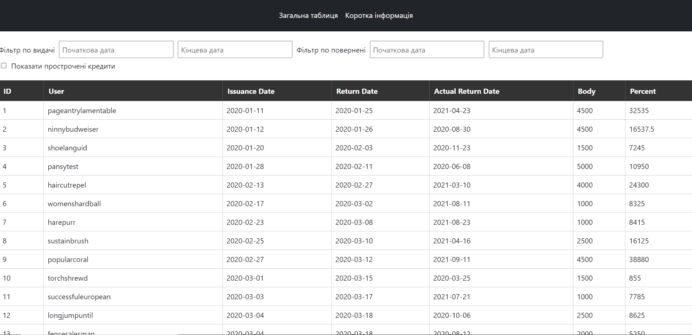
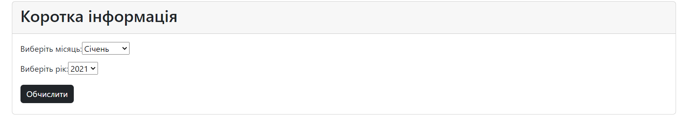

# Фінансовий Дашборд

## Опис

Фінансовий Дашборд - це веб-додаток, розроблений для відображення фінансової інформації та статистики. Додаток дозволяє користувачам візуалізувати дані про кредити, борги, прибуток та інші фінансові параметри у зручному форматі.

## Основні функції

- **Відображення кредитів:** Додаток відображає список кредитів, включаючи їхні збори та умови.
  
- **Статистика за категоріями:** Фінансовий дашборд розподіляє кредити та прибуток за різними категоріями.
- **Можливість фільтрування данних:** Фільтрує за датою, яку вписав користувач
  
- **Відстеження боргів:** Додаток дозволяє користувачам відстежувати борги та їхні строки погашення.

- **Зручний інтерфейс:** Фінансовий дашборд має привабливий та зручний інтерфейс для користувача.

## Сторінка "Коротка інформація"


Цей розділ відображає коротку статистику та фінансові показники з вашого фінансового дашборду. Тут ви можете швидко побачити основні дані та статистику за останній період часу.

- **Середня сума кредитів:** Відображає середню суму виданих кредитів за обраний період.

- **Загальна сума кредитів:** Показує загальну суму всіх виданих кредитів.

- **Загальна сума відсотків:** Відображає загальну суму відсотків, отриманих за відповідний період.

- **Кількість виданих кредитів:** Показує кількість виданих кредитів.

- **Кількість повернутих кредитів:** Показує кількість кредитів, які були повернуті в установлені строки.

- **Топ користувачів:** Показує топ користувачів за отриманими кредитами, за сплаченими відсотками, за вернутими кредитами.
  

  Ця сторінка дає вам можливість швидко оцінити фінансову активність та ефективність кредитування в вашій компанії.

## Технології

Проект розроблено з використанням наступних технологій:

- **Angular:** Веб-фреймворк для створення клієнтських додатків.

- **HTML/CSS:** Для створення користувацького інтерфейсу.

- **Bootstrap:** Для стилізації та розмітки.

## Встановлення

Для запуску проекту локально виконайте наступні кроки:

1. Склонуйте цей репозиторій:

```bash
 git clone https://github.com/Anna-Grigorovichfinancial-dashboard.git
```

2. Встановіть необхідні залежності:

```bash
npm install
```

3. Запустіть додаток:

```bash
ng serve

```
